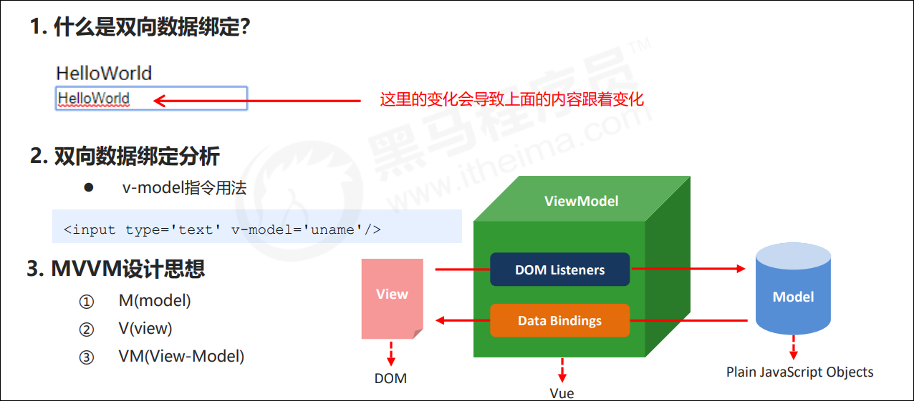

# 一、vue模板语法
### 1模板概述
##### （1）前端渲染
就是把数据填充到HTML标签中，模板就是HTML标签与数据进行结合的过程程直为前端渲染，产物就是静态的HTML内容
##### （2） 前端渲染方式
- 原生js拼接字符串
  基本上就是将数据以字符串的方式拼接到HTML标签中
  如：
  ```js
    var d = data.weather;
    var info = document.getElementById('info');
    info.innerHTML = '';
    for(var i=0;i<d.length;i++){
    var date = d[i].date;
    var day = d[i].info.day;
    var night = d[i].info.night;
    var tag = '';
    tag += '<span>日期：'+date+'</sapn><ul>';
    tag += '<li>白天天气：'+day[1]+'</li>'
    tag += '<li>白天温度：'+day[2]+'</li>'
    tag += '<li>白天风向：'+day[3]+'</li>'
    tag += '<li>白天风速：'+day[4]+'</li>'
    tag += '</ul>';
    var div = document.createElement('div');
    div.innerHTML = tag;
    info.appendChild(div);
    }
  ```
  缺点: 
&nbsp;&nbsp;&nbsp;&nbsp;&nbsp;&nbsp;&nbsp;&nbsp;不同开发人员的代码风格差别很大，随着业务的复杂，后期的维护变得逐渐困难起来。

<br>

- 使用前端模板引擎

&nbsp;&nbsp;&nbsp;&nbsp;&nbsp;&nbsp;&nbsp;&nbsp;是基于模板引擎art-template的一段代码，与拼接字符串相比，代码明显规范了很多，它拥有自己的一套模板语法规则。
```js
<script id="abc" type="text/html">
    {{if isAdmin}}
        <h1>{{title}}</h1>
        <ul>
    {{each list as value i}}
        <li>索引 {{i + 1}} ：{{value}}</li>
    {{/each}}
        </ul>
    {{/if}}
</script>

```
<mark>优点</mark>:大家都遵循同样的规则写代码，代码可读性明显提高了，方便后期的维护。

<mark>缺点</mark>：没有专门提供事件机制


- 使用vue特有的模板语法
    - 差值表达式
    - 指令
    - 事件绑定
    - 属性绑定
    - 样式绑定
    - 分支循环结构

### 2 指令

##### （1）什么是指令
- 什么是自定义属性
- 指令的本质就是自定义属性
- 指令的格式：以v-开始（比如：v-cloak）

##### v-cloak
- 插值表达式存在的问题：“闪动”
<mark>也就是页面在现实的瞬间模板并没有进行替换，而是显示的是本来的内容包括花括号，之后才进行渲染</mark>
- 如何解决该问题：使用v-cloak指令
- 解决该问题的原理：先隐藏，替换好值之后再显示最终的值

<strong>使用指令：https://cn.vuejs.org/v2/api/</strong>

##### 数据绑定指令
- v-text
更新元素的 textContent。如果要更新部分的 textContent，需要使用 {{ Mustache }} 插值。
- v-html
值为HTML结构，更新元素的 innerHTML。注意：内容按普通 HTML 插入 - 不会作为 Vue 模板进行编译。如果试图使用 v-html 组合模板，可以重新考虑是否通过使用组件来替代。
<strong>注意</strong>
在网站上动态渲染任意 HTML 是非常危险的，因为容易导致 XSS 攻击。只在可信内容上使用 v-html，永不用在用户提交的内容上。
- v-pre
显示原始信息，跳过编译过程（分析编译过程）

##### 数据响应式
- 如何理解响应式
① html5中的响应式（屏幕尺寸的变化导致样式的变化）
② 数据的响应式（数据的变化导致页面内容的变化）
- 什么是数据绑定
① 数据绑定：将数据填充到标签中
- v-once 只编译一次
① 显示内容之后不再具有响应式功能


我们可以通过控制台访问msg

这个数据也可以直接修改

这就是数据绑定

- 指令v-once
```js
<!DOCTYPE html>
<html lang="en">

<head>
    <meta charset="UTF-8">
    <meta name="viewport" content="width=device-width, initial-scale=1.0">
    <title>Document</title>
</head>

<body>
    <div id="app" >
        <div v-cloak>{{msg + '我来了'}}</div>
        <div v-once>{{msg1}}</div>
    </div>
    <script src="../js/vue.js"></script>
    <script>
        var vm = new Vue({
            // 元素的挂载位置（值可以是css选择器也可以是dom元素）
            el: '#app',
            // 模型数据
            data: {
                msg: 'hello vue',
                msg1: '修改我'
            }
        })
    </script>
</body>

</html>
```


添加了v-once的数据就不能再修改了，没有了数据响应式
使用场合：
&nbsp;&nbsp;&nbsp;&nbsp;&nbsp;&nbsp;&nbsp;&nbsp;如果显示的信息后续不再修改，可以使用v-once，这样可以提高性能，如果信息是响应式的，vue就要监控他是否变化了。数据驱动页面的变化，我们不用显式的操作dom

### 3 数据双向绑定



```js
<!DOCTYPE html>
<html lang="en">

<head>
    <meta charset="UTF-8">
    <meta name="viewport" content="width=device-width, initial-scale=1.0">
    <title>Document</title>
</head>

<body>
    <div id="app" >
        <div v-cloak>{{msg}}</div>
        <div v-once>
            <input type="text" v-model='msg' name="" id="">
        </div>
    </div>
    <script src="../js/vue.js"></script>
    <script>
        var vm = new Vue({
            // 元素的挂载位置（值可以是css选择器也可以是dom元素）
            el: '#app',
            // 模型数据
            data: {
                msg: 'hello vue',
                msg1: '修改我'
            }
        })
    </script>
</body>

</html>
```


<strong>两行数据绑定的是同一条msg，在输入框中修改msg的值，上面一行的值也发生了变化，控制台中的数据也随之改变</strong>

### 4 事件绑定
- v-on指令
```html
<input type='' v-on:click='num++'>
```
- 简写
```html
<input type='' @click='num++'>
```

```js
<!DOCTYPE html>
<html lang="en">

<head>
    <meta charset="UTF-8">
    <meta name="viewport" content="width=device-width, initial-scale=1.0">
    <title>Document</title>
</head>

<body>
    <div id="app" >
        <div>{{num}}</div>
        <!-- <button v-on:click='num++'>点击</button> -->
        <button @click='num++'>点击</button>
    </div>
    <script src="../js/vue.js"></script>
    <script>
        var vm = new Vue({
            // 元素的挂载位置（值可以是css选择器也可以是dom元素）
            el: '#app',
            // 模型数据
            data: {
                num: 0
            }
        })
    </script>
</body>

</html>
```

- 事件函数的调用
    - 直接绑定函数名称
    ```html
        <button @click='Function Name'>点击</button>
    ```
    - 调用函数
    ```html
        <button @click='Function Name（）'>点击</button>
    ```

    
    不能直接使用html中的变量名，要使用this

    ```js
    this.num++
    ```
函数需要定义在methods属性中

```js
<!DOCTYPE html>
<html lang="en">

<head>
    <meta charset="UTF-8">
    <meta name="viewport" content="width=device-width, initial-scale=1.0">
    <title>Document</title>
</head>

<body>
    <div id="app" >
        <div>{{num}}</div>
        <!-- <button v-on:click='num++'>点击</button> -->
        <button @click='num++'>点击1</button>
        <button @click='handle'>点击2</button>
        <button @click='handle()'>点击3</button>
    </div>
    <script src="../js/vue.js"></script>
    <script>
        var vm = new Vue({
            // 元素的挂载位置（值可以是css选择器也可以是dom元素）
            el: '#app',
            // 模型数据
            data: {
                num: 0
            },

            methods: {
                handle: function(){
                    /*
                        this就是vue的实例，vm
                    */
                   console.log(this === vm);
                   this.num++
                }
            }
        })
    </script>
</body>

</html>
```

- 事件函数参数传递

    - 普通参数和事件对象
    ```html
    <button @click="Function Name（'hi', $event）">点击</button>
    ```
```html
<!DOCTYPE html>
<html lang="en">

<head>
    <meta charset="UTF-8">
    <meta name="viewport" content="width=device-width, initial-scale=1.0">
    <title>Document</title>
</head>

<body>
    <div id="app">
        <div>{{num}}</div>
        <!-- <button v-on:click='num++'>点击</button> -->
        <button @click='num++'>点击1</button>
        <button @click='handle1'>点击2</button>
        <button @click='handle2(123, 456, $event)'>点击3</button>
    </div>
    <script src="../js/vue.js"></script>
    <script>
        var vm = new Vue({
            // 元素的挂载位置（值可以是css选择器也可以是dom元素）
            el: '#app',
            // 模型数据
            data: {
                num: 0
            },

            methods: {
                handle1: function (event) {
                    /*
                        第一种直接调用函数名的形式
                        事件函数的第一个参数就是事件对象
                    */
                    console.log(event);
                    console.log(event.target.tagName);
                    this.num++
                },

                handle2: function (p, p1, event) {
                    /*
                        this就是vue的实例，vm
                    */
                    //console.log(this === vm);//true

                    /*
                        可以传入多个参数，参数最后一个是事件对象，名字$event，固定
                    */

                    console.log(p);
                    console.log(p1);
                    // 获取事件对象
                    console.log(event);
                    // 获取触发事件的dom元素
                    console.log(event.target.tagName);
                    // 获取触发事件的dom元素的内容
                    console.log(event.target.innerHTML);
                    this.num++
                }
            }
        })
    </script>
</body>

</html>
```

- 事件修饰符
    - .stop 阻止冒泡
    ```html
    <a v-on:click.stop='handle'></a>
    ```
    - .prevent 阻止默认行为
    ```html
    <a v-on:click.prevent='handle'></a>
    ```

    

```html
<!DOCTYPE html>
<html lang="en">

<head>
    <meta charset="UTF-8">
    <meta name="viewport" content="width=device-width, initial-scale=1.0">
    <title>Document</title>
</head>

<body>
    <div id="app">
        <div>{{num}}</div>
        <div v-on:click='handle2'> 
            <button v-on:click.stop='handle1'>点击</button>
        </div>

        <a href="http://www.baidu.com" v-on:click.prevent='handle3'>百度</a>
    </div>
    <script src="../js/vue.js"></script>
    <script>
        var vm = new Vue({
            // 元素的挂载位置（值可以是css选择器也可以是dom元素）
            el: '#app',
            // 模型数据
            data: {
                num: 0
            },

            methods: {
                handle1: function () {
                    this.num++
                },

                handle2: function () {
                    this.num += 10
                },

                handle3: function(){}
            }
        })
    </script>
</body>

</html>
```

- 按键修饰符
    - .enter 回车键
    ```html
    <input v-on:keyup.enter='submit'>
    ```
    - .delete 删除键
    ```.html
    <input v-on:keyup.delete='submit'>
    ```
    - .tab / .esc /.space/ .up/.down /.left/ .right
```html
<!DOCTYPE html>
<html lang="en">

<head>
    <meta charset="UTF-8">
    <meta name="viewport" content="width=device-width, initial-scale=1.0">
    <title>Document</title>
</head>

<body>
    <div id="app">
        <form action="">
            <input type="text" v-model='uname'>
            <input type="text" v-model='pwd' v-on:keyup.enter='handleSubmit'>
            <input type="button" v-on:click='handleSubmit' value="提交" name="" id="">
        </form>
    </div>
    <script src="../js/vue.js"></script>
    <script>
        var vm = new Vue({
            // 元素的挂载位置（值可以是css选择器也可以是dom元素）
            el: '#app',
            // 模型数据
            data: {
                num: 0
            },

            methods: {
                handleSubmit: function(){
                    console.log(this.uname, this.pwd);
                }
            }
        })
    </script>
</body>

</html>

```

- 自定义按键修饰符
    - 全局config.keyCodes对象
    ```html
    Vue.config.keyCode.自定义 = 112 // 这个值是按键修饰符的唯一值
    ```

    弃用


### 5 属性绑定
- 动态处理属性
    - v-bind
    ````html
    <a v-bind:href='url'>跳转</a>
    ```
    - 缩写形式
    ````html
    <a :href='url'>跳转</a>
    ```
```html
<!DOCTYPE html>
<html lang="en">

<head>
    <meta charset="UTF-8">
    <meta name="viewport" content="width=device-width, initial-scale=1.0">
    <title>Document</title>
</head>

<body>
    <div id="app">
        <a v-bind:href="url">跳转</a>
        <a :href="url1">跳转</a>
        <button v-on:click='handle'>切换</button>
    </div>

    <script src="../js/vue.js"></script>
    <script>
        var vm = new Vue({
            el: '#app',
            data: {
                url: 'http://www.baidu.com',
                url1: 'https://www.jianshu.com/writer#/notebooks/47973210/notes/79616255'
            },
            methods: {
               handle: function(){
                   this.url='https://cn.vuejs.org/v2/api/#v-on'
               }
            }
        })
    </script>
</body>

</html>
```

- v-model的底层实现原理
    - 第一种
    ```html
    <!DOCTYPE html>
    <html lang="en">

    <head>
        <meta charset="UTF-8">
        <meta name="viewport" content="width=device-width, initial-scale=1.0">
        <title>Document</title>
    </head>

    <body>

        <!-- 
            v-model的底层原理
            使用输入域中的最新数据覆盖原来的数据
         -->

        <div id="app">
            <input type="text" v-bind:value="msg" v-on:input='handle'>
            <div>{{msg}}</div>
        </div>

        <script src="../js/vue.js"></script>
        <script>
            var vm = new Vue({
                el: '#app',
                data: {
                    msg: 'hello'
                },
                methods: {
                    handle: function (event) {
                        this.msg = event.target.value
                    }
                }
            })
        </script>
    </body>

    </html>
    ```

    - 第二种，简写
    ```html
        <input type="text" v-bind:value="msg" v-on:input='msg=$event.target.value'>
    ````

### 6 样式绑定
- 对象语法
```html
<!DOCTYPE html>
<html lang="en">

<head>
    <meta charset="UTF-8">
    <meta name="viewport" content="width=device-width, initial-scale=1.0">
    <title>Document</title>
    <style>
        .active{
            border: 1px solid red;
            width: 100px;
            height: 100px;
        }
    </style>
</head>

<body>

    <!-- 
        v-model的底层原理
        使用输入域中的最新数据覆盖原来的数据
     -->

    <div id="app">
        <div v-bind:class="{active: isActive}"></div>
        <button v-on:click='handle'>切换</button>
    </div>

    <script src="../js/vue.js"></script>
    <script>
        var vm = new Vue({
            el: '#app',
            data: {
                isActive: true
            },
            methods: {
                handle: function (event) {
                    this.isActive = !this.isActive;
                }
            }
        })
    </script>
</body>

</html>
```

如添加多个类名
```html
<!DOCTYPE html>
<html lang="en">

<head>
    <meta charset="UTF-8">
    <meta name="viewport" content="width=device-width, initial-scale=1.0">
    <title>Document</title>
    <style>
        .active{
            border: 1px solid red;
            width: 100px;
            height: 100px;
        }

        .error{
            background-color: orange;
        }
    </style>
</head>

<body>

    <!-- 
        v-model的底层原理
        使用输入域中的最新数据覆盖原来的数据
     -->

    <div id="app">
        <div v-bind:class="{active: isActive, error: isError}">测试</div>
        <button v-on:click='handle'>切换</button>
    </div>

    <script src="../js/vue.js"></script>
    <script>
        var vm = new Vue({
            el: '#app',
            data: {
                isActive: true,
                isError: true
            },
            methods: {
                handle: function (event) {
                    this.isActive = !this.isActive;
                    this.isError = !this.isError;
                }
            }
        })
    </script>
</body>

</html>
```
- 数组语法
```html
<!DOCTYPE html>
<html lang="en">

<head>
    <meta charset="UTF-8">
    <meta name="viewport" content="width=device-width, initial-scale=1.0">
    <title>Document</title>
    <style>
        .active{
            border: 1px solid red;
            width: 100px;
            height: 100px;
        }

        .error{
            background-color: orange;
        }
    </style>
</head>

<body>

    <!-- 
        v-model的底层原理
        使用输入域中的最新数据覆盖原来的数据
     -->

    <div id="app">
        <div v-bind:class="[activeClass, errorClass]">测试</div>
        <button v-on:click='handle'>切换</button>
    </div>

    <script src="../js/vue.js"></script>
    <script>
        var vm = new Vue({
            el: '#app',
            data: {
                activeClass: 'active',
                errorClass: 'error'
            },
            methods: {
                handle: function (event) {
                    this.activeClass = '';
                    this.errorClass = '';
                }
            }
        })
    </script>
</body>

</html>
```

- style样式处理
    - 对象语法
    ```html
    <!DOCTYPE html>
    <html lang="en">
    
    <head>
        <meta charset="UTF-8">
        <meta name="viewport"   content="width=device-width, initial-scale=1.0">
        <title>Document</title>
        <style>
            
        </style>
    </head>
    
    <body>
    
        <div id="app">
            < v-bind:style='{border: borderStyle,    width: widthStyle, height: heightStyle}'></    div>
            <button v-on:click='handle'>切换</button>
        </div>
    
        <script src="../js/vue.js"></script>
        <script>
            var vm = new Vue({
                el: '#app',
                data: {
                    borderStyle: '1px solid red',
                    widthStyle: '300px',
                    heightStyle: '300px'
                },
                methods: {
                   handle: function(){
                       this.heightStyle = '500px'
                   }
                }
            })
        </script>
    </body>
    
    </html>
    ```

    简写：
    ```html
    <!DOCTYPE html>
    <html lang="en">
    
    <head>
        <meta charset="UTF-8">
        <meta name="viewport"   content="width=device-width, initial-scale=1.0">
        <title>Document</title>
        <style>
            
        </style>
    </head>
    
    <body>
    
        <div id="app">
            <div v-bind:style='objStyles'></div>
            <button v-on:click='handle'>切换</button>
        </div>
    
        <script src="../js/vue.js"></script>
        <script>
            var vm = new Vue({
                el: '#app',
                data: {
                    objStyles: {
                        border: '1px solid red',
                        width:' 200px',
                        height: '300px'
                    }
                },
                methods: {
                   handle: function(){
                       this.objStyles.width = '500px'
                   }
                }
            })
        </script>
    </body>
    
    </html>
    ```
    - 数组语法
    ```html
    ```