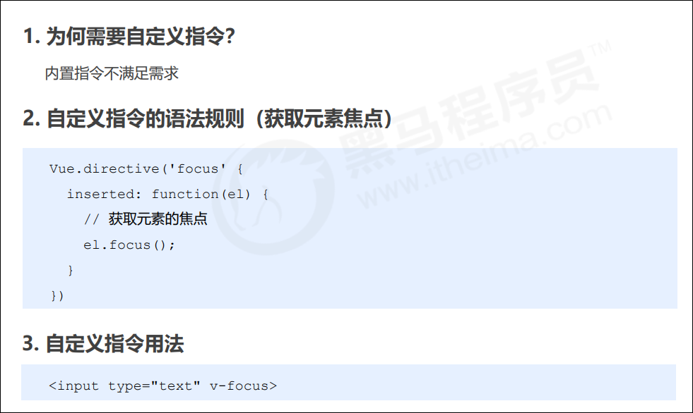
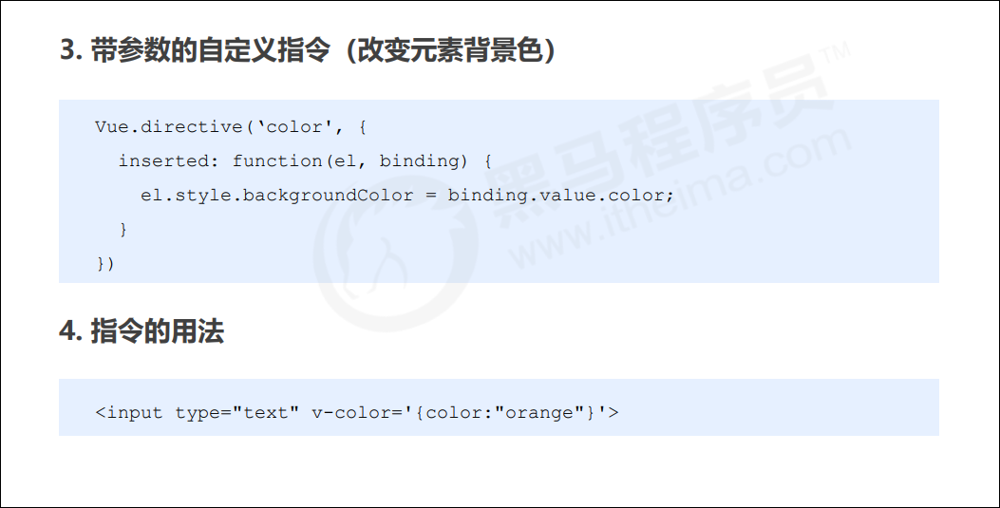
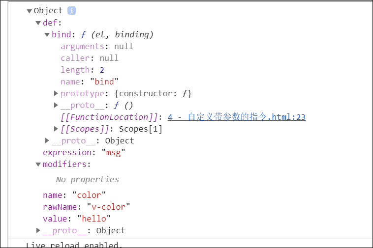
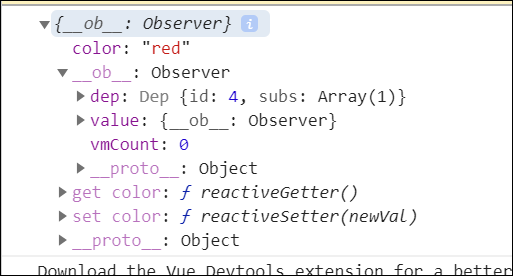
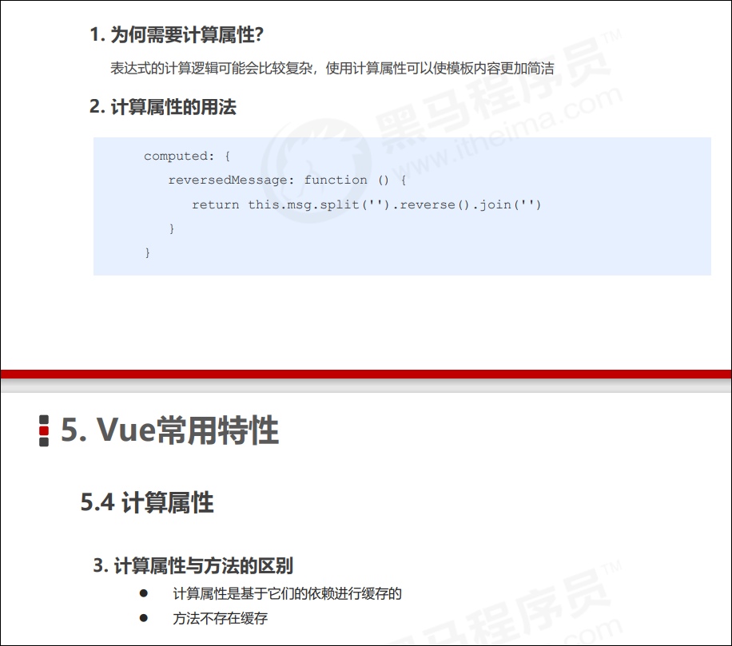
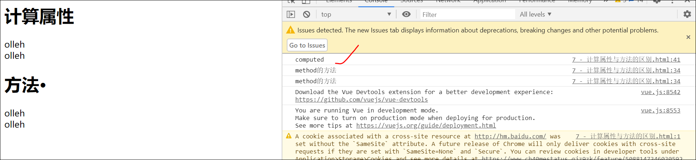
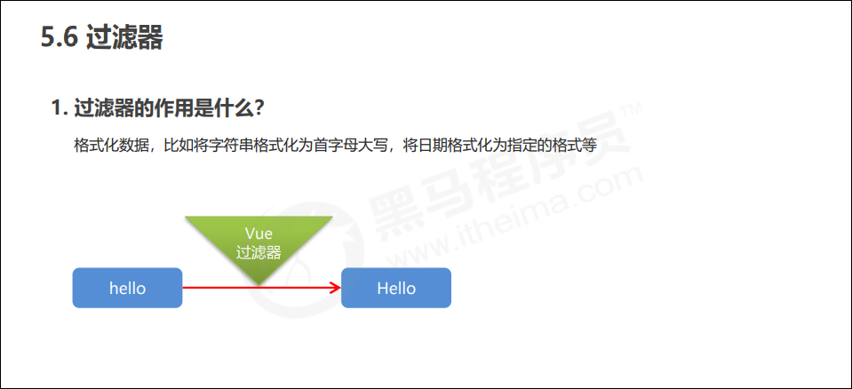
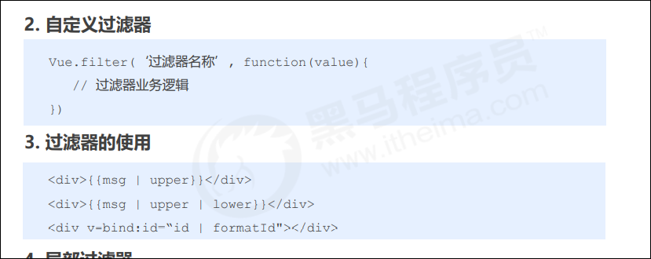
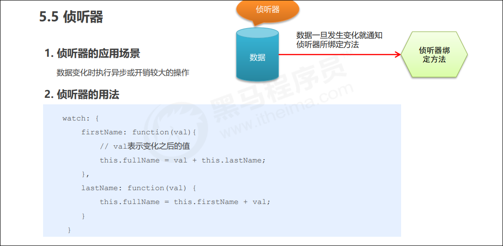

# vue 常用特性

#### 表单操作

<strong>1.基于vue的表单操作</strong> 

- input
- textarea
- select
- radio
- checkbox

```html
<!DOCTYPE html>
<html lang="en">
<head>
  <meta charset="UTF-8">
  <title>Document</title>
  <style type="text/css">
  
  form div {
    height: 40px;
    line-height: 40px;
  }
  form div:nth-child(4) {
    height: auto;
  }
  form div span:first-child {
    display: inline-block;
    width: 100px;
  }
  </style>
</head>
<body>
  <div id="app">
    <form action="http://itcast.cn">
      <div>
        <span>姓名：</span>
        <span>
          <input type="text" v-model='uname'>
        </span>
      </div>
      <div>
        <span>性别：</span>
        <span>
          <input type="radio" id="male" value="1" v-model='gender'>
          <label for="male">男</label>
          <input type="radio" id="female" value="2" v-model='gender'>
          <label for="female">女</label>
        </span>
      </div>
      <div>
        <span>爱好：</span>
        <input type="checkbox" id="ball" value="1" v-model='hobby'>
        <label for="ball">篮球</label>
        <input type="checkbox" id="sing" value="2" v-model='hobby'>
        <label for="sing">唱歌</label>
        <input type="checkbox" id="code" value="3" v-model='hobby'>
        <label for="code">写代码</label>
      </div>
      <div>
        <span>职业：</span>
        <!-- 添加multiple变成多选 -->
        <select v-model='job' multiple>
          <option value="0">请选择职业...</option>
          <option value="1">教师</option>
          <option value="2">软件工程师</option>
          <option value="3">律师</option>
        </select>
      </div>
      <div>
        <span>个人简介：</span>
        <!-- 在vue中要将内容写在v-model中，而不是标签之间 -->
        <textarea v-model='des'></textarea>
      </div>

      <!--  -->
      <div>
        <input type="submit" value="提交" @click.prevent='handle'>
      </div>
    </form>
  </div>
  <script type="text/javascript" src="../js/vue.js"></script>
  <script type="text/javascript">
    /*
      表单基本操作
    */
    var vm = new Vue({
      el: '#app',
      data: {
        uname: 'list',
        gender: 2,
        hobby: ['2', '3'],

        // 单选
        // job: 2
        // 多选
        job: [2]

        ,
        des: 'nihao'
      },
      methods: {
        handle: function(){
            console.log(this.uname);
            console.log(this.gender);
            console.log(this.hobby.toString());
            console.log(this.job);
            console.log(this.des);
        }
      }
    });
  </script>
</body>
</html>
```

<strong>2.表单域修饰符</strong> 
- number: 转化为数值
- trim：去掉开始和结尾的空格
- lazy：将input事件装换成change事件(失去焦点时触发)

```html
<!DOCTYPE html>
<html lang="en">

<head>
    <meta charset="UTF-8">
    <meta name="viewport" content="width=device-width, initial-scale=1.0">
    <title>Document</title>
    <style>

    </style>
</head>

<body>

    <div id="app">
        <input type="text" v-model.number='age'>
        <button @click='handle'>点击</button>

        <input type="text" v-model.trim='info'>
        <input type="text" v-model.lazy='msg'>
        <div>{{msg}}</div>
    </div>

    <script src="../js/vue.js"></script>
    <script>
        var vm = new Vue({
            el: '#app',
            data: {
                age: '',
                info: '',
                msg: ''

            },
            methods: {
                handle: function () {
                    console.log(this.age + 13);
                    console.log(this.info);
                }
            }
        })
    </script>
</body>

</html>
```

#### 自定义指令

1.简单自定义



```html
<!DOCTYPE html>
<html lang="en">

<head>
    <meta charset="UTF-8">
    <meta name="viewport" content="width=device-width, initial-scale=1.0">
    <title>Document</title>
    <style>

    </style>
</head>

<body>

    <div id="app">
        <input type="text" v-focus>
    </div>

    <script src="../js/vue.js"></script>
    <script>
        /*
            自定义指令
        */
        Vue.directive('focus', {
            inserted: function (el) {
                el.focus()
            }
        })

        var vm = new Vue({
            el: '#app',
            data: {

            },
            methods: {

            }
        })
    </script>
</body>

</html>
```

2.自定义带参数的指令



```html
<!-- 初步 -->
<!DOCTYPE html>
<html lang="en">

<head>
    <meta charset="UTF-8">
    <meta name="viewport" content="width=device-width, initial-scale=1.0">
    <title>Document</title>
    <style>

    </style>
</head>

<body>

    <div id="app">
       <input type="text" name="" id="" v-color='msg'>
    </div>

    <script src="../js/vue.js"></script>
    <script>

        Vue.directive('color', {
            bind: function(el, binding){
                console.log(binding);
            }
        })

        var vm = new Vue({
            el: '#app',
            data: {
                msg: 'hello'
            },
            methods: {

            }
        })
    </script>
</body>

</html>
```



```html
<!-- 若数据是对象 -->
<!DOCTYPE html>
<html lang="en">

<head>
    <meta charset="UTF-8">
    <meta name="viewport" content="width=device-width, initial-scale=1.0">
    <title>Document</title>
    <style>

    </style>
</head>

<body>

    <div id="app">
       <input type="text" name="" id="" v-color='msg'>
    </div>

    <script src="../js/vue.js"></script>
    <script>

        Vue.directive('color', {
            bind: function(el, binding){
                console.log(binding.value.color);
            }
        })

        var vm = new Vue({
            el: '#app',
            data: {
                msg: {
                    color: 'red'
                }
            },
            methods: {

            }
        })
    </script>
</body>

</html>
```




设置背景色

```html
<!DOCTYPE html>
<html lang="en">

<head>
    <meta charset="UTF-8">
    <meta name="viewport" content="width=device-width, initial-scale=1.0">
    <title>Document</title>
    <style>

    </style>
</head>

<body>

    <div id="app">
       <input type="text" name="" id="" v-color='msg'>
    </div>

    <script src="../js/vue.js"></script>
    <script>

        Vue.directive('color', {
            bind: function(el, binding){
                // 根据参数设置背景色
                el.style.backgroundColor = binding.value.color
            }
        })

        var vm = new Vue({
            el: '#app',
            data: {
                msg: {
                    color: 'red'
                }
            },
            methods: {

            }
        })
    </script>
</body>

</html>
```

3.局部指令

```html
<!DOCTYPE html>
<html lang="en">

<head>
    <meta charset="UTF-8">
    <meta name="viewport" content="width=device-width, initial-scale=1.0">
    <title>Document</title>
    <style>

    </style>
</head>

<body>

    <div id="app">
        <input type="text" name="" id="" v-color='msg'>
        <input type="text" name="" id="" v-focus>
    </div>

    <script src="../js/vue.js"></script>
    <script>
        var vm = new Vue({
            el: '#app',
            data: {
                msg: {
                    color: 'blue'
                }
            },
            methods: {

            },
            directives: {
                // 一个或者多个局部指令
                color: {
                    bind: function (el, binding) {
                        // 根据参数设置背景色
                        el.style.backgroundColor = binding.value.color
                    }
                },

                focus: {
                    inserted: function(el){
                        el.focus()
                    }
                }
            }
        })
    </script>
</body>

</html>
```

#### 计算属性



基于data中的数据进行操作的，简化模板中的计算

```html
<!DOCTYPE html>
<html lang="en">

<head>
    <meta charset="UTF-8">
    <meta name="viewport" content="width=device-width, initial-scale=1.0">
    <title>Document</title>
    <style>

    </style>
</head>

<body>

    <div id="app">
       <div>{{reverseString}}</div>

       <!-- 原生js反转字母 -->
       <div>{{msg.split('').reverse().join('')}}</div>
    </div>

    <script src="../js/vue.js"></script>
    <script>
        var vm = new Vue({
            el: '#app',
            data: {
                msg: 'hello'
            },
            methods: {

            },
            computed: {
                reverseString: function(){
                    return this.msg.split('').reverse().join('')
                }
            }
        })
    </script>
</body>

</html>
```

<strong>计算属性与方法的区别
</strong>

```html
<!DOCTYPE html>
<html lang="en">

<head>
    <meta charset="UTF-8">
    <meta name="viewport" content="width=device-width, initial-scale=1.0">
    <title>Document</title>
    <style>

    </style>
</head>

<body>

    <div id="app">
        <h1>计算属性</h1>
       <div>{{reverseString}}</div>
       <div>{{reverseString}}</div>

       <h1>方法·</h1>
       <div>{{reversestring()}}</div>
       <div>{{reversestring()}}</div>
    </div>

    <script src="../js/vue.js"></script>
    <script>
        var vm = new Vue({
            el: '#app',
            data: {
                msg: 'hello'
            },
            methods: {
                reversestring: function () {
                    console.log('method的方法');
                    return this.msg.split('').reverse().join('')

                }
            },
            computed: {
                reverseString: function(){
                    console.log('computed');
                    return this.msg.split('').reverse().join('')
                }
            }
        })
    </script>
</body>

</html>
```



思考：缓存的优缺点

#### 过滤器

1.简单过滤器




使用过滤器

```html
<!DOCTYPE html>
<html lang="en">

<head>
    <meta charset="UTF-8">
    <meta name="viewport" content="width=device-width, initial-scale=1.0">
    <title>Document</title>
    <style>

    </style>
</head>

<body>

    <div id="app">
        <!-- 场景1：插值表达式 -->
       <input type="text" v-model='msg'>
       <div>{{msg | upper}}</div>
       <div>{{msg | lower}}</div>

       <!-- 场景二：属性绑定 -->
       <div :abc="msg | upper">测试</div>
    </div>

    <script src="../js/vue.js"></script>
    <script>

        /*
            过滤器
        */
       // 首字母大写
       Vue.filter('upper', function (val) {
           return val.charAt(0).toUpperCase() + val.slice(1)
       })

       Vue.filter('lower', function (val) {
           return val.charAt(0).toLowerCase() + val.slice(1)
       })


        var vm = new Vue({
            el: '#app',
            data: {
                msg: ''
            },
            methods: {

            }
        })
    </script>
</body>

</html>
```

2.局部过滤器
```html
<!DOCTYPE html>
<html lang="en">

<head>
    <meta charset="UTF-8">
    <meta name="viewport" content="width=device-width, initial-scale=1.0">
    <title>Document</title>
    <style>

    </style>
</head>

<body>

    <div id="app">
        <input type="text" v-model='msg'>
        <div>{{msg | upper}}</div>
    </div>

    <script src="../js/vue.js"></script>
    <script>

        


        var vm = new Vue({
            el: '#app',
            data: {
                msg: ''
            },
            methods: {

            },
            filters: {
                upper: function (val) {
                    return val.charAt(0).toUpperCase() + val.slice(1)
                }
            }
        })
    </script>
</body>

</html>
```


#### 侦听器



```html
<!-- 初步 -->
<!DOCTYPE html>
<html lang="en">

<head>
    <meta charset="UTF-8">
    <meta name="viewport" content="width=device-width, initial-scale=1.0">
    <title>Document</title>
    <style>

    </style>
</head>

<body>

    <div id="app">
        <div>
            <span>名：</span>
            <span>
                <input type="text" v-model='firstn'>
            </span>
        </div>
        <div>
            <span>姓：</span>
            <span>
                <input type="text" v-model='lastn'>
            </span>
        </div>
        <div>{{name}}</div>
    </div>

    <script src="../js/vue.js"></script>
    <script>
        var vm = new Vue({
            el: '#app',
            data: {
                firstn: 'Jim',
                lastn: 'Green',
                name: 'Jim Green'
            },
            methods: {

            },

            watch: {
                firstn: function (val) {
                    this.name = val + '' + this.lastn
                },

                lastn: function (val) {
                    this.name = this.firstn + '' + val
                },
            }
        })
    </script>
</body>

</html>
```

计算属性模拟侦听器

```html
<!DOCTYPE html>
<html lang="en">

<head>
    <meta charset="UTF-8">
    <meta name="viewport" content="width=device-width, initial-scale=1.0">
    <title>Document</title>
    <style>

    </style>
</head>

<body>

    <div id="app">
        <div>
            <span>名：</span>
            <span>
                <input type="text" v-model='firstn'>
            </span>
        </div>
        <div>
            <span>姓：</span>
            <span>
                <input type="text" v-model='lastn'>
            </span>
        </div>
        <div>{{name}}</div>
    </div>

    <script src="../js/vue.js"></script>
    <script>
        var vm = new Vue({
            el: '#app',
            data: {
                firstn: 'Jim',
                lastn: 'Green',
                // name: 'Jim Green'
            },
            methods: {

            },

            // 使用计算属性模拟侦听器要注释掉name
            computed: {
                name: function () {
                    return this.firstn + "" + this.lastn
                }
            },

            watch: {
                // firstn: function (val) {
                //     this.name = val + '' + this.lastn
                // },

                // lastn: function (val) {
                //     this.name = this.firstn + '' + val
                // },
            }
        })
    </script>
</body>

</html>
```

#### 生命周期

