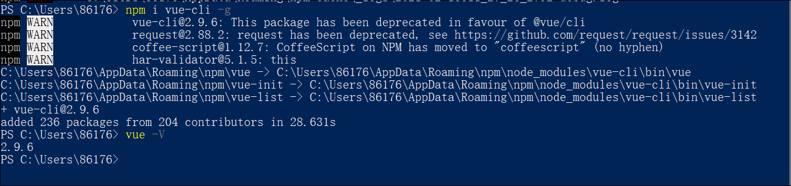
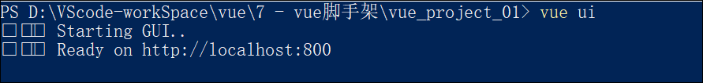
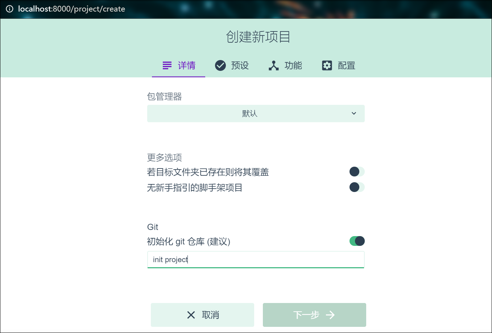

全局安装以及查看版本号

npm install -g @vue/cli
https://blog.csdn.net/weixin_44455926/article/details/104619677

<strong>基于3.x版本的脚手架创建vue项目</strong>

- 基于交互式命名行的方式，创建新版vue项目
```
vue create my-project
```

- 基于图形化的方式，创建新版vue项目
```
vue ui
```



暂时填写git仓库即可




- 基于2.x的旧模板，创建旧版vue项目
```
npm install -g @vue/cli-init
vue init webpack my-project
```

**手动**
babel,vouter,linker,使用配置文件

**配置**
ESLint + Standard config


<strong>vue配置</strong> 

**1.配置json文件**
```json
"vue": {
    "devServer": {
      "port": 8888,
      "open": true
    }
  }
```

**2.根目录下创建vue.config.js**

```js
module.exports = {
    devServe: {
        port: 8000,
        open: true
    }
}
```

## elementUI的使用

- 下载： npm install element-ui -S

- 手动配置
```js
// main.js
//导入element-ui
import ElementUi from 'element-ui'
import 'element-ui/lib/theme-chalk/index.css'
Vue.use(ElementUi)
```

- 基于图形化界面自动安装
    - vue ui
    - 通过vue项目管理器，进入具体的项目配置面板
    - 点击插件，添加插件
    - 搜索vue-cli-plugin-element
    - 配置插件，实现按需导入